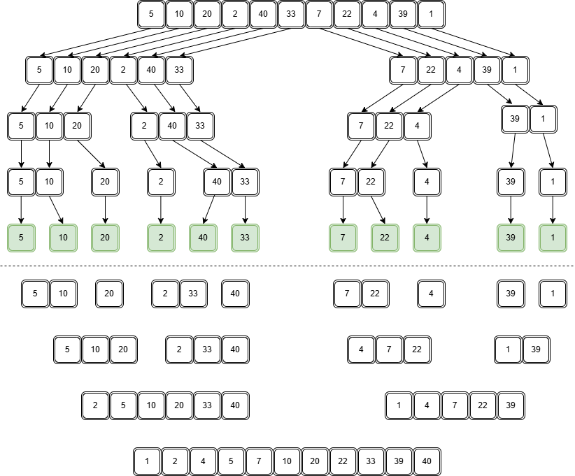
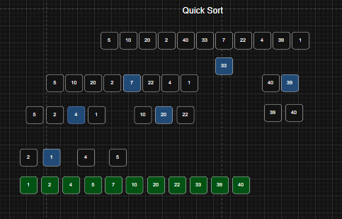

# Metodos Ordenamiento Avanzado
## Nombre: Gabriel Cuenca
## Fecha: 20/05/2026

### Se realizaron los diagramas de los métodos de ordenamiento tanto de Quick Sort como del Merge Sort, además se creo un nuevo proyecto de java que incluyé el metodo de MergeSort para ordenar datos.

## Diagrama Merge Sort

## Diagrama Quick Sort

